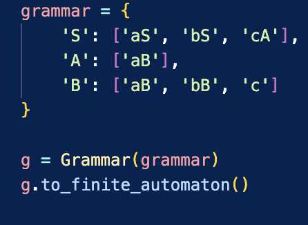
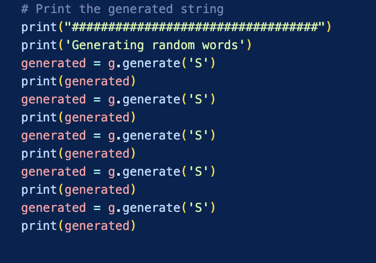
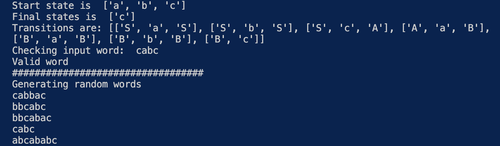

# Laboratory work no. 1 report.
### Course: Formal Languages & Finite Automata
### Student: Andreea Manole,  FAF-212 
### Task 15
## Tasks:
1. Understand what a language is and what it needs to have in order to be considered a formal one.

2. Provide the initial setup for the evolving project that you will work on during this semester. I said project because
usually at lab works, I encourage/impose students to treat all the labs like stages of development of a whole project. 
Basically you need to do the following:

    a. Create a local && remote repository of a VCS hosting service (let us all use Github to avoid unnecessary headaches);

    b. Choose a programming language, and my suggestion would be to choose one that supports all the main paradigms;

    c. Create a separate folder where you will be keeping the report. This semester I wish I won't see reports alongside
source code files, fingers crossed;

3. According to your variant number (by universal convention it is register ID), get the grammar definition and do the 
following tasks:

    a. Implement a type/class for your grammar;

    b. Add one function that would generate 5 valid strings from the language expressed by your given grammar;

    c. Implement some functionality that would convert and object of type Grammar to one of type Finite Automaton;
    
    d. For the Finite Automaton, please add a method that checks if an input string can be obtained via the state 
transition from it;

---

## Implementations:
I've managed to create 2 classes: **Grammar** and **Finite_automaton** in order to complete the lab.

    1.Grammar class has 3 methods, first being one that parses the input dictionary into the 4 parameters of a valid regullar grammar (terminals, non-terminals, start symbol and productions/grammar);

    2.Second method is the one that generates a random string (using random library) by starting with the start symbol and joining random rules in order to generate s atring;

    3.Third method is the tricky one, the one used to convert an object of type Grammar to one of type Finite_automaton. The basic conversions use the formula provided in the course lecture. The states are generated using the lowercase keys of the grammar. Transitions are formed respecting the graammar through appending;

Here is the input parameter given to the grammar object during initiation.

**Finite_automaton** class has one method __CheckWord__ that checks whether an input string is valid based on the FA's attributes. i mostly check validation through the initial states, final states and alphabet present.

**Main.py** is used to instantiate Grammar class, and finally call the methods needed as shown bellow:

---
## Results

---
## Conclusions
In this laboratory work I learned how to transform my current LFAF knowledge into code, check my unerstanding by using the rules provided to generate strings, convert RE to FA, implement a validation method and output my results to the user.

